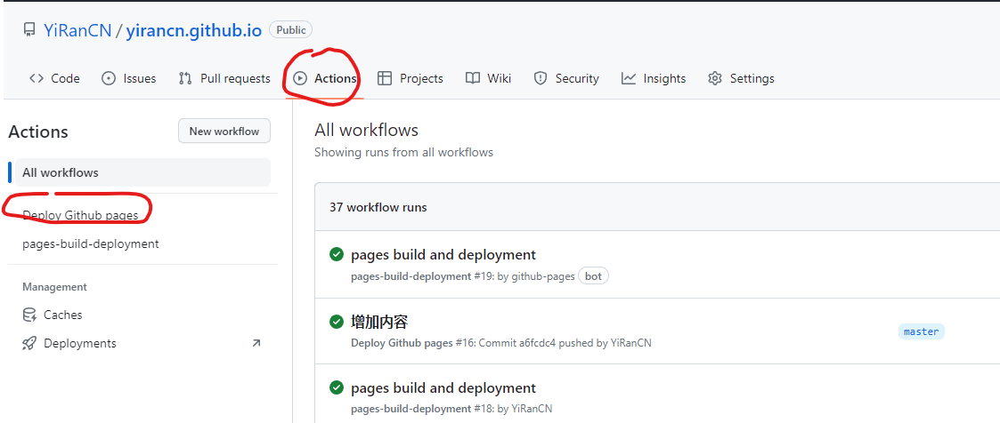

### 创建 docusaurus 前端工程

此网站主要使用的技术是`docusaurus`，创建工程参考 [Docusaurus 介绍](https://docusaurus.io/zh-CN/docs)

:::tip

核心命令很简单

```js
npx create-docusaurus@latest my-website classic
cd my-website
npx docusaurus start
```

:::

### GITHUB 的 Action 功能

使用 GITHUB 的 Action 功能，在工程内创建.github/workflows/documentation.yml 文件，内容如下：

:::tip

.github/workflows/documentation.yml

```js
name: Deploy Github pages
on:
  push:
    branches:
      - master
permissions:
  contents: write
jobs:
  build-and-deploy:
    runs-on: ubuntu-latest
    steps:
      - name: Checkout
        uses: actions/checkout@v3

      - name: Install and Build 🔧
        run: |
          npm i
          npm run build

      - name: Deploy 🚀
        uses: JamesIves/github-pages-deploy-action@v4
        with:
          folder: build # The folder the action should deploy.
```

:::


