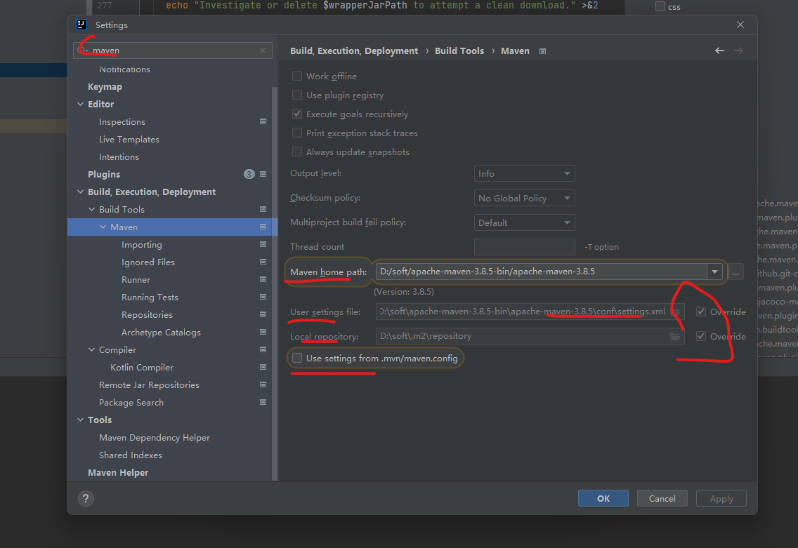

### Maven 在 IDEA 的最佳配置

团队固定使用某个版本的 Maven，自行在官网下载 https://maven.apache.org/download.cgi

在 IDEA 中设置



### 注意 settings.xml 的一些配置

```xml

<localRepository>D:\soft\.m2\repository</localRepository>

<server>
    <id>xx-nexus</id>
    <username>admin</username>
    <password>123456</password>
</server>

<!-- 阿里镜像地址 -->
<mirror>
    <id>alimaven</id>
    <name>aliyun maven</name>
    <url>http://maven.aliyun.com/nexus/content/repositories/central/</url>
    <mirrorOf>central</mirrorOf>
</mirror>

```
