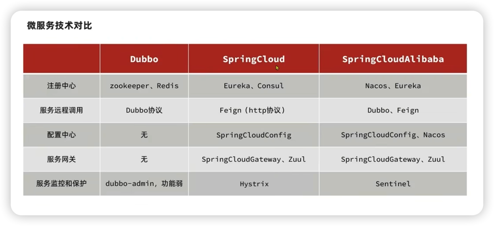

# 微服务

微服务是分布式架构的一种；

分布式架构是相对单体架构来说的。

分布式架构相对于单体架构是复杂的，单体架构耦合多很高，适用于系统相对简单，业务相对单一的场景。

分布式架构相对于分布式架构来说，耦合性低，相对独立，适用于系统相对复杂，业务相对多元的场景。

分布式架构需要考虑的问题：

- 服务拆分的粒度如何？不能太小，也不能太大，总体来说，先大后小；
- 服务集群的地址如何维护？就是上注册中心了；
- 服务之间如何通信？HTTP、RPC、消息队列等；
- 服务之间如何容错？服务降级、服务熔断、服务限流等；
- 服务健康状态如何感知？

分布式架构有很多，其中包括 WebService、ESB、Hession、Dubbo、SpringCloud、gRPC 等；

