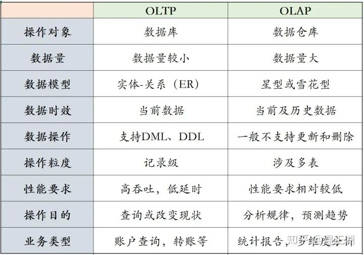

#### 1. OLAP与OLTP的区别？

OLTP(Online transaction processing):在线/联机事务处理。典型的OLTP类操作都比较简单，主要是对数据库中的数据进行增删改查，操作主体一般是产品的用户。

OLAP(Online analytical processing):指联机分析处理。通过分析数据库中的数据来得出一些结论性的东西。比如给老总们看的报表，用于进行市场开拓的用户行为统计，不同维度的汇总分析结果等等。操作主体一般是运营、销售和市场等团队人员。

单次OLTP处理的数据量比较小，所涉及的表非常有限，一般仅一两张表。而OLAP是为了从大量的数据中找出某种规律性的东西，经常用到count()、sum()和avg()等聚合方法，用于了解现状并为将来的计划/决策提供数据支撑，所以对多张表的数据进行连接汇总非常普遍。

为了表示跟OLTP的数据库（database）在数据量和复杂度上的不同，一般称OLAP的操作对象为数据仓库（data warehouse），简称数仓。数据库仓库中的数据，往往来源于多个数据库，以及相应的业务日志。

#### 参考

1. [OLAP与OLTP的区别](https://blog.csdn.net/weixin_44087159/article/details/124477313)
