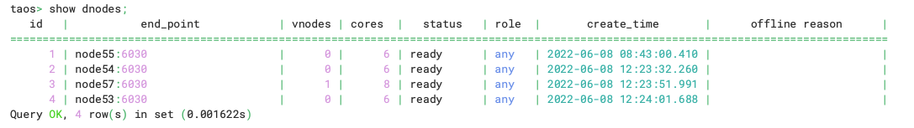
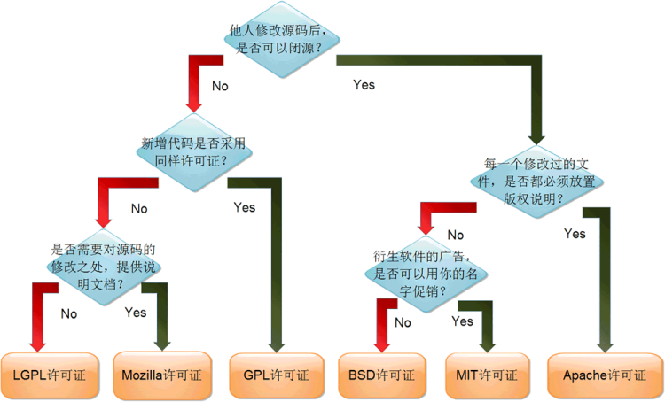

[官网](https://www.taosdata.com/)
[GitHub 链接地址](https://github.com/taosdata/TDengine)

### 简介

开源协议：AGPL V3
开发语言：C
商业公司：北京涛思数据科技有限公司(TAOS Data) ；涛思数据采用 AGPL 许可证，已经将 TDengine 的内核(存储、计算引擎和集群）100%开源。涛思数据将尽最大努力打造开发者社区，维护这个开源的商业模式，相信不将最核心的代码开源，任何基础软件都将无法赢得市场。涛思数据希望通过开源，快速获得市场反馈，完善产品，完善生态，而且吸引更多的开发者加入到这个项目中。
支持集群：开源版本支持集群

### 评价

1. 国内公司众多项目使用，使用量还是很高的；
2. 开源既支持集群，大数据量的拓展是没问题的；
3. 文档相对来说是非常友好的，方方面面俱到；

### 部署

#### 环境准备

文档是中文的，还是不错的。[安装文档](https://github.com/taosdata/TDengine/blob/develop/README-CN.md)

问运维童鞋要了预研使用的服务器，如下：

| hostname | ip           |
| -------- | ------------ |
| node57   | 192.168.0.57 |
| node54   | 192.168.0.54 |
| node53   | 192.168.0.53 |
| node55   | 192.168.0.55 |

看了一下操作系统版本为 Centos 7，大家根据自己服务器的操作系统安装不同命令，以下都是基于 Centos7 的

```shell
[root@centos ~]# cat /etc/redhat-release
CentOS Linux release 7.9.2009 (Core)
```

根据文档依次执行：

```shell
sudo yum install -y gcc gcc-c++ make cmake git

sudo yum install -y java-1.8.0-openjdk

#maven不要这么安装，有可能版本比较低 只能说有可能
sudo yum install -y maven

sudo yum install zlib-devel xz-devel snappy-devel jansson jansson-devel pkgconfig libatomic libstdc++-static

git clone https://github.com/taosdata/TDengine.git
cd TDengine

#Go 连接器和 Grafana 插件在其他独立仓库，如果安装它们的话，需要在 TDengine 目录下通过此命令安装：
git submodule update --init --recursive
```

执行最后的命令的时候，会报错，需要配置 git，【YiRanCN】和【weic059@163.com】都是我的 git 账号，需要根据自己的账号自行配置

```shell
git config --global http.sslVerify false
git config --global user.name "YiRanCN"
git config --global user.email "xxx@163.com"

ssh-keygen -t rsa -C "YiRanCN"

#获取 之后 不要后面的账号 复制下来
cat /root/.ssh/id_rsa.pub
```

根据【cat /root/.ssh/id_rsa.pub】这个得结果，放到 github 账号的【SSH and GPG keys】功能下面


#### 构建&安装【源码】

构建很简单，自带构建脚本

```shell
./build.sh
```

#### 构件安装【安装包】

下载地址：【[https://docs.tdengine.com/get-started/#!](https://docs.tdengine.com/get-started/#!)】
执行【rpm -i TDengine-server-2.6.0.1-Linux-x64.rpm】，如果只是安装非集群版本直接回车即可。
【sudo systemctl start taosd】启动；
执行【sudo systemctl status taosd】检查运行状态

如果需要卸载：
【sudo rpm -qa|grep tdengine】
【sudo rpm -e tdengine】
【sudo rm -rf /var/lib/taos/\*】慎用

#### 体验 SQL

```shell
CREATE DATABASE demo;
USE demo;
CREATE TABLE t (ts TIMESTAMP, speed INT);
INSERT INTO t VALUES('2019-07-15 00:00:00', 10);
INSERT INTO t VALUES('2019-07-15 01:00:00', 20);
SELECT * FROM t;
```

为降低学习门槛，TDengine 采用传统的关系型数据库模型管理数据，和 MySQL 没啥太大区别。

#### 集群部署

因为我的目标是集群，所以，上面的都是开胃小菜。

| hostname | ip           |
| -------- | ------------ |
| node57   | 192.168.0.57 |
| node54   | 192.168.0.54 |
| node53   | 192.168.0.53 |
| node55   | 192.168.0.55 |

使用
【hostnamectl set-hostname node57】
【hostnamectl set-hostname node54】
【hostnamectl set-hostname node53】
【hostnamectl set-hostname node55】
命令修改 hostname.
将如下配置放到【vim /etc/hosts】文件内

```shell
192.168.0.57 node57
192.168.0.54 node54
192.168.0.53 node53
192.168.0.55 node55
```

所有的节点安装一遍。
集群搭建完成，如下图所示：


### 基本概念

#### 采集量 (Metric)

采集量是指传感器、设备或其他类型采集点采集的物理量，比如电流、电压、温度、压力、GPS 位置等，是随时间变化的，数据类型可以是整型、浮点型、布尔型，也可是字符串。随着时间的推移，存储的采集量的数据量越来越大。

#### 标签 (Label/Tag)

标签是指传感器、设备或其他类型采集点的静态属性，不是随时间变化的，比如设备型号、颜色、设备的所在地等，数据类型可以是任何类型。虽然是静态的，但 TDengine 容许用户修改、删除或增加标签值。与采集量不一样的是，随时间的推移，存储的标签的数据量不会有什么变化。

#### 数据采集点 (Data Collection Point)

数据采集点是指按照预设时间周期或受事件触发采集物理量的硬件或软件。一个数据采集点可以采集一个或多个采集量，**但这些采集量都是同一时刻采集的，具有相同的时间戳**。对于复杂的设备，往往有多个数据采集点，每个数据采集点采集的周期都可能不一样，而且完全独立，不同步。比如对于一台汽车，有数据采集点专门采集 GPS 位置，有数据采集点专门采集发动机状态，有数据采集点专门采集车内的环境，这样一台汽车就有三个数据采集点。

#### 表 (Table)

因为采集量一般是结构化数据，同时为降低学习门槛，TDengine 采用传统的关系型数据库模型管理数据。用户需要先创建库，然后创建表，之后才能插入或查询数据。
为充分利用其数据的时序性和其他数据特点，TDengine 采取**一个数据采集点一张表**的策略，要求对每个数据采集点单独建表（比如有一千万个智能电表，就需创建一千万张表，上述表格中的 d1001，d1002，d1003，d1004 都需单独建表），用来存储这个数据采集点所采集的时序数据。这种设计有几大优点：

1. 由于不同数据采集点产生数据的过程完全独立，每个数据采集点的数据源是唯一的，一张表也就只有一个写入者，这样就可采用无锁方式来写，写入速度就能大幅提升。
2. 对于一个数据采集点而言，其产生的数据是按照时间排序的，因此写的操作可用追加的方式实现，进一步大幅提高数据写入速度。
3. 一个数据采集点的数据是以块为单位连续存储的。如果读取一个时间段的数据，它能大幅减少随机读取操作，成数量级的提升读取和查询速度。
4. 一个数据块内部，采用列式存储，对于不同数据类型，采用不同压缩算法，而且由于一个数据采集点的采集量的变化是缓慢的，压缩率更高。

如果采用传统的方式，将多个数据采集点的数据写入一张表，由于网络延时不可控，不同数据采集点的数据到达服务器的时序是无法保证的，写入操作是要有锁保护的，而且一个数据采集点的数据是难以保证连续存储在一起的。**采用一个数据采集点一张表的方式，能最大程度的保证单个数据采集点的插入和查询的性能是最优的。**
TDengine 建议用数据采集点的名字（如上表中的 D1001）来做表名。每个数据采集点可能同时采集多个采集量（如上表中的 current，voltage，phase），每个采集量对应一张表中的一列，数据类型可以是整型、浮点型、字符串等。除此之外，表的第一列必须是时间戳，即数据类型为 timestamp。对采集量，TDengine 将自动按照时间戳建立索引，但对采集量本身不建任何索引。数据用列式存储方式保存。
对于复杂的设备，比如汽车，它有多个数据采集点，那么就需要为一台汽车建立多张表。

#### 超级表 (STable)

由于一个数据采集点一张表，导致表的数量巨增，难以管理，而且应用经常需要做采集点之间的聚合操作，聚合的操作也变得复杂起来。为解决这个问题，TDengine 引入超级表（Super Table，简称为 STable）的概念。
超级表是指某一特定类型的数据采集点的集合。同一类型的数据采集点，其表的结构是完全一样的，但每个表（数据采集点）的静态属性（标签）是不一样的。描述一个超级表（某一特定类型的数据采集点的集合），除需要定义采集量的表结构之外，还需要定义其标签的 schema，标签的数据类型可以是整数、浮点数、字符串，标签可以有多个，可以事后增加、删除或修改。如果整个系统有 N 个不同类型的数据采集点，就需要建立 N 个超级表。
在 TDengine 的设计里，**表用来代表一个具体的数据采集点，超级表用来代表一组相同类型的数据采集点集合**。

这里的超级表、子表的设计很有意思，子表就是某个设备（虚拟的，其他也行），这个是数据放到一块的最小单位，这里和其他时序数据库的很大区别，可有有效处理“设备删了，数据还存在的问题”。

#### 子表 (Subtable)

当为某个具体数据采集点创建表时，用户可以使用超级表的定义做模板，同时指定该具体采集点（表）的具体标签值来创建该表。**通过超级表创建的表称之为子表**。正常的表与子表的差异在于：

1. 子表就是表，因此所有正常表的 SQL 操作都可以在子表上执行。
2. 子表在正常表的基础上有扩展，它是带有静态标签的，而且这些标签可以事后增加、删除、修改，而正常的表没有。
3. 子表一定属于一张超级表，但普通表不属于任何超级表
4. 普通表无法转为子表，子表也无法转为普通表。

超级表与与基于超级表建立的子表之间的关系表现在：

1. 一张超级表包含有多张子表，这些子表具有相同的采集量 schema，但带有不同的标签值。
2. 不能通过子表调整数据或标签的模式，对于超级表的数据模式修改立即对所有的子表生效。
3. 超级表只定义一个模板，自身不存储任何数据或标签信息。因此，不能向一个超级表写入数据，只能将数据写入子表中。

查询既可以在表上进行，也可以在超级表上进行。针对超级表的查询，TDengine 将把所有子表中的数据视为一个整体数据集进行处理，会先把满足标签过滤条件的表从超级表中找出来，然后再扫描这些表的时序数据，进行聚合操作，这样需要扫描的数据集会大幅减少，从而显著提高查询的性能。本质上，TDengine 通过对超级表查询的支持，实现了多个同类数据采集点的高效聚合。
TDengine 系统建议给一个数据采集点建表，需要通过超级表建表，而不是建普通表。

#### 库 (database)

库是指一组表的集合。TDengine 容许一个运行实例有多个库，而且每个库可以配置不同的存储策略。不同类型的数据采集点往往具有不同的数据特征，包括数据采集频率的高低，数据保留时间的长短，副本的数目，数据块的大小，是否允许更新数据等等。为了在各种场景下 TDengine 都能最大效率的工作，TDengine 建议将不同数据特征的超级表创建在不同的库里。

一个库里，可以有一到多个超级表，但一个超级表只属于一个库。一个超级表所拥有的子表全部存在一个库里。

这里一定要注意，我们在设计库的时候，一定要根据数据的情况来，例如上下线消息和设备历史数据应该分两个库，因为他们的数据保留时间不同，设备上下线消息存 1 年就很多了，设备历史数据可能需要存 5 年以上。

### 准备数据

结合上面的概念以及 SQL 语法可以创建表做压测了，SQL 是参考目前 influxdb 存储的历史数据来的。

```sql
# 保存10年 1个副本
create database ucloud keep 3650 REPLICA 2;
use ucloud;

#创建超级表
create stable datapoint_record(ts timestamp,value double,StringValue NCHAR(128),DataType NCHAR(10),StorageFlag int)
 tags(DeviceId NCHAR(32),DataPointId int,SlaveIndex int);
#插入测试数据
insert into D00500221122700004100_1_1 using datapoint_record
tags(00500221122700004100,1,1)
values(now(),1,"1","ushort",1);
insert into D00500221122700004100_1_2 using datapoint_record
tags(00500221122700004100,1,2)
values(now(),1,"1","ushort",1);
#查询
select * from datapoint_record;

```

最重点的其实是表结构的设计了，结合我们的业务，我们平台的“采集量”是配置出来，所以采集量是不固定的，用户会根据自己的事情情况动态的增删。所以我们的子表只能有一个采集量，这个是关键。

我们目前用的时序数据库是 InfluxDB，所以需要有个中间件，软实时同步到 TDengine。实现思路为：

1. 定时每分钟；
2. 导出 InfluxDB 数据，一分钟的；
3. 读取这个导出文件，并插入到 TDengine 中；

### 压测

自带 taosBenchmark 性能测试工具，可以使用。

无命令行参数直接运行 taosBenchmark，回车直接执行，默认在 TDengine 中创建一个名为 test 的数据库，test 数据库下创建名为 meters 的一张超级表，超级表下创建 10000 张表，每张表中写入 10000 条记录。


1w 张表用了接近 4 分钟创建完成，当然了和测试服务器的机械硬盘应该有很大关系；


插入 1 亿调数据用了 18 秒，当然了和测试服务器的机械硬盘应该有很大关系；

### 坑点汇总

1. 社区版本不支持“删除指定时间范围的数据”的功能，企业版才支持，但是有些特殊情况还是需要删除数据的，可以通过增加“删除标记字段”来迂回处理这个问题。
2. 社区版本不支持“UAF”，也就是用户自定义函数，某些特殊聚合或计算算法无法做到，不过社区版本提供的已经是绝对部分了。

### 附录

#### 开源协议说明


