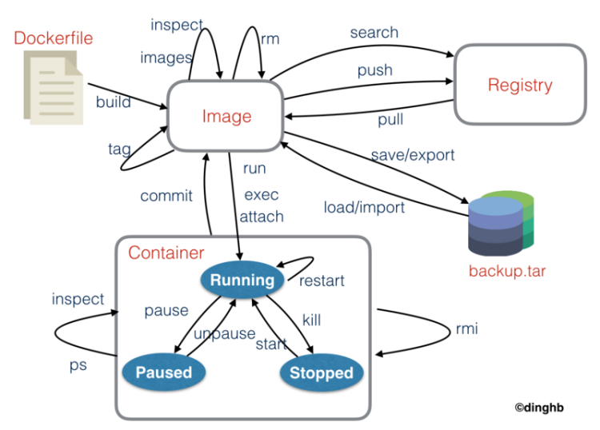

1. Docker 官方仓库  [https://hub.docker.com](https://hub.docker.com)
2. 脚本搜索版本号  [docker-tags](https://blog.csdn.net/CodyGuo/article/details/86515354)

### 修改镜像源

/etc/docker/daemon.json

```json
{
  "registry-mirrors": ["https://registry.docker-cn.com", "http://hub-mirror.c.163.com", "https://docker.mirrors.ustc.edu.cn"]
}
```

```shell
docker info | grep Reg
```

### 常用命令大全

docker --help



### 获取某个 docker 容器的 IP 地址

```shell
docker inspect -f '{{range .NetworkSettings.Networks}}{{.IPAddress}}{{end}}' container_name_or_id
```

### 容器自动启动

```shell
docker run  --restart=always
#no -  容器退出时，不重启容器；
#on-failure - 只有在非0状态退出时才从新启动容器；
#always - 无论退出状态是如何，都重启容器；
#如果创建时未指定 --restart=always ,可通过update 命令
docker update --restart=always container_name_or_id
docker update --restart=no container_name_or_id
```

### 容器时区问题

```shell
# 创建容器的时候加上这个参数 会让容器采用宿主机的时区
-v /etc/localtime:/etc/localtime
```

### 查看和清除容器日志

```shell
#
ls -lh $(find /var/lib/docker/containers/ -name *-json.log)
#
truncate -s 0 /var/lib/docker/containers/*/*-json.log
#用于查看Docker的磁盘使用情况
docker system df
#用于查看Docker的磁盘使用情况 详细情况
docker system df -v
#用于清理磁盘，删除关闭的容器、无用的数据卷和网络，以及dangling镜像（即无tag的镜像）
docker system prune
#清理得更加彻底，可以将没有容器使用Docker镜像都删掉。
docker system prune -a
```

### 版本太低 需要升级

```shell
# docker build 报错如下
is not a valid repository/tag: invalid reference format
# 检查版本 docker 版本太低
docker version


# 卸载旧版本
yum -y remove docker*
# 安装需要的软件包， yum-util 提供yum-config-manager功能，另外两个是devicemapper驱动依赖的
sudo yum install -y yum-utils
# 设置yum源
yum-config-manager --add-repo http://mirrors.aliyun.com/docker-ce/linux/centos/docker-ce.repo
# 安装docker
yum install docker-ce docker-ce-cli containerd.io
# 配置国内docker镜像源
mkdir -p /etc/docker
tee /etc/docker/daemon.json <<-'EOF'
{
  "registry-mirrors": [
  "https://kfwkfulq.mirror.aliyuncs.com",
  "https://2lqq34jg.mirror.aliyuncs.com",
  "https://pee6w651.mirror.aliyuncs.com",
  "https://registry.docker-cn.com",
  "http://hub-mirror.c.163.com"
  ],
  "dns": ["8.8.8.8","8.8.4.4"]
}
EOF
# 重启docker
systemctl daemon-reload
systemctl restart docker
# 验证docker版本
docker version
```
```shell
#!/bin/bash

echo "stop docker"
systemctl stop docker


echo "uninstall rpm docker"
rpm -e --nodeps --docfiles docker-ce-rootless-extras-26.0.0-1.el7.aarch64
rpm -e --nodeps --docfiles docker-ce-26.0.0-1.el7.aarch64
rpm -e --nodeps --docfiles docker-ce-cli-26.0.0-1.el7.aarch64
rpm -e --nodeps --docfiles docker-buildx-plugin-0.13.1-1.el7.aarch64
rpm -e --nodeps --docfiles containerd.io-1.6.28-3.2.el7.aarch64

echo "rm -rf /opt/containerd /var/lib/containerd /var/lib/docker"
rm -rf /opt/containerd
rm -rf /var/lib/containerd
rm -rf /var/lib/docker

echo "success"
```

### run后保持运行状态

```shell
#
docker run -tid \
--privileged=true \
--name test-ubuntu \
ubuntu
#
docker run -tid \
--privileged=true \
--name test-nginx \
nginx:stable-alpine3.17-slim
```

### 绑定随机端口

```shell
#
docker run -tid \
-p :80 \
--privileged=true \
--name test-ubuntu \
ubuntu
# 重启之后 随机的端口会换掉
docker port test-ubuntu
# 重启之后 随机的端口会换掉
docker restart test-ubuntu
# 重启之后 随机的端口会换掉
docker port test-ubuntu
```

### dcoker save/load 保存和加载镜像

对镜像的保存和加载
```shell
docker load < xx.tar.xz
```

### docker export/import 导出和导入容器

对容器的导出和导入

### Linux修改网络后，导致Docker容器网络出现问题

- [csdn-Linux重启网络后导致容器网络无法连接的解决办法](https://blog.csdn.net/m0_61230499/article/details/137916082)
  
### Docker容器生成镜像

```shell
docker   commit -m="描述信息" -a="作者" 容器id 目标镜像名： [TAG]

```

也可以用于容器端口修改，先把容器生成镜像，然后再根据镜像重新创建容器


```shell
# docker ps | grep svs   需要根据这个数据改动新容器
a32f69aaf58d   ccsp-svs-openeuler-x86:3.3.2.6.27          "/bin/bash -c 'sh /o…"   19 hours ago   Up About a minute   
10.20.18.50:21000->20010/tcp, 10.20.18.50:21003->20012/tcp, 10.20.18.50:21001->20014/tcp, 10.20.18.50:21002->20015/tcp                                 
ccsp-svs-6890163980627742089
# 生成镜像
docker commit -m="test" -a="weic" ccsp-svs-6890163980627742089 svstest:20016-12
# 停止并改名老的
docker stop ccsp-svs-6890163980627742089
docker rename ccsp-svs-6890163980627742089 ccsp-svs-6890163980627742089-bak
# IP得改 前后两个端口得改 映射的20016、20018前后两个端口可以不用动 默认2核4g
docker run \
-td \
-p 10.20.18.50:21000:20010 \
-p 10.20.18.50:21003:20012 \
-p 10.20.18.50:21001:20014 \
-p 10.20.18.50:21002:20015 \
-p 10.20.18.50:20016:20016 \
-p 10.20.18.50:20018:20018 \
--cpus 2 \
--memory 4g \
--name ccsp-svs-6890163980627742089 \
svstest:20016-12 \
/bin/bash -c "sh /opt/sansec/ccsp/startService.sh&bash"
```

修改shmsize  共享内存

```shell
fbaabf1d7e74   ccsp-tsc-openeuler-x86:3.3.1.3             "/bin/bash -c 'sh /o…"   4 minutes ago       Up 4 minutes       10.0.101.146:26501->8011/tcp, 10.0.101.146:26502->8099/tcp                                                                                                                                 ccsp-tsc-6745104769515389829
#
docker commit -m="test" -a="weic" ccsp-tsc-6745104769515389829 tsctest:shmsize-1
#
docker stop ccsp-tsc-6745104769515389829
#
docker run \
-td \
--shm-size 1gb \
-p 10.0.101.146:26501:8011 \
-p 10.0.101.146:26502:8099 \
--name ccsp-tsc-6745104769515389829-c \
tsctest:shmsize-1 \
/bin/bash -c "sh /opt/sansec/ccsp/startService.sh&bash"

docker run \
-td \
--name ccsp-tsc-6745104769515389829-c \
tsctest:shmsize-1 \
/bin/bash -c "sh /opt/sansec/ccsp/startService.sh&bash"
```


### 删除几天之前的容器

```shell
#!/bin/bash

# 设置天数阈值
days=2
 
# 找到创建时间在几天前的容器ID
container_ids=$(docker ps --format '{{.ID}} {{.CreatedAt}}' | awk -v days_ago=$days '$2 < "'$(date -d "$days days ago" +'%Y-%m-%d')'"' | cut -d ' ' -f1)
 
# 删除这些容器
docker rm -f $container_ids
```

### 未运行的容器中的文件修改

```shell
# 先copy出来
docker cp {containerID}:/xxx/xxx ./xxx
# 修改完之后 在copy进去
docker cp ./xxx {containerID}:/xxx/xxx
```

### 设置cpu数量以及内存大小

```shell
docker update --cpus 4 --memory 8g {容器名称或ID}
```

### 清理容器和镜像

```shell

# 停止所有正在运行的容器
docker stop $(docker ps -aq)
 
# 删除所有容器
docker rm $(docker ps -aq)
 
# 删除所有镜像
docker rmi $(docker images -q)
```

### 参考

[参考 1](https://developer.aliyun.com/article/272173)
