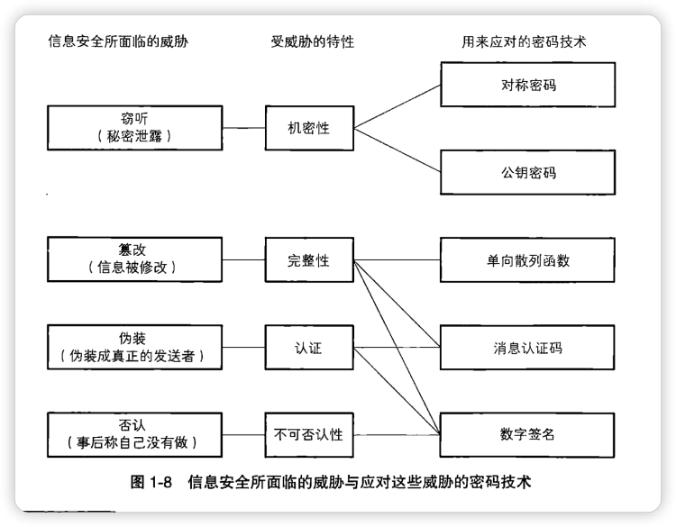
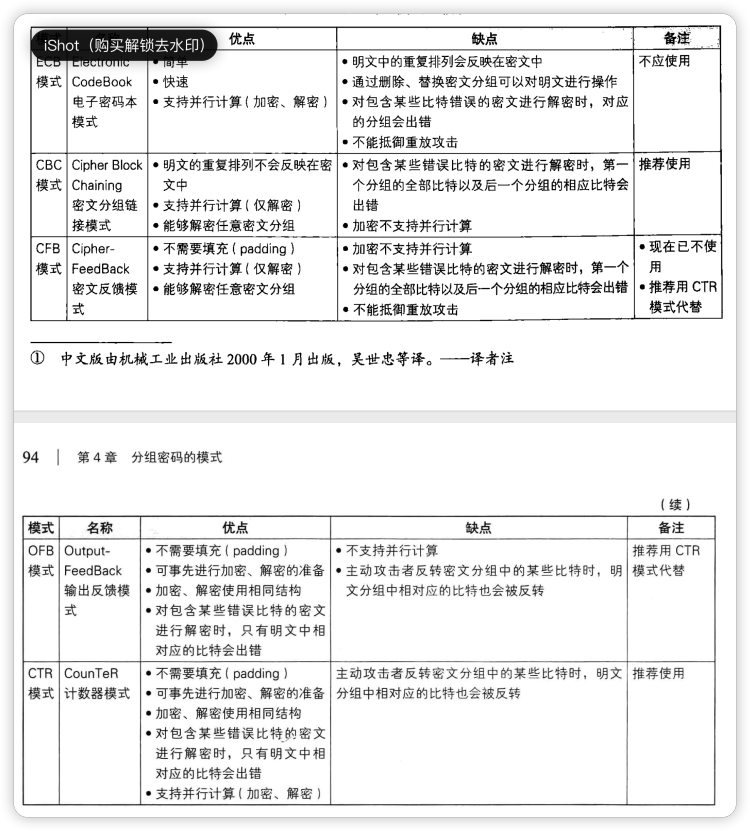
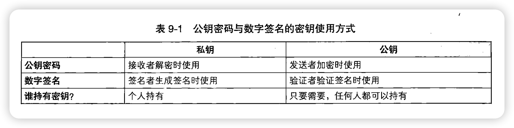
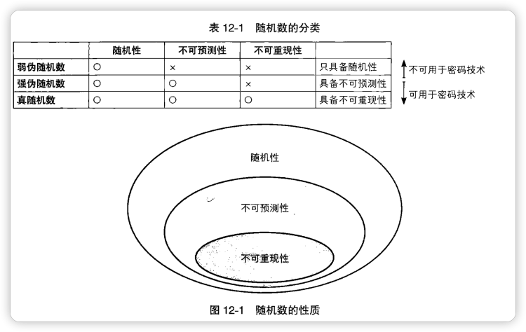
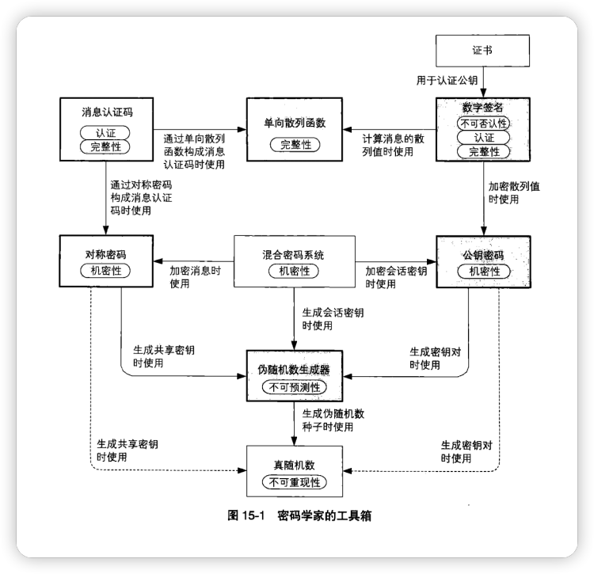

### 密码学家的工具箱

包括：

1. 对称加密，加密和解密的秘钥是一样的；
2. 非对称加密，加密和解密的秘钥是不一样的；
3. 单项散列函数，就是哈希；
4. 消息认证码；
5. 数字签名；
6. 伪随机数生成器；

凯撒密码加密：是通过将明文中所使用的字母表按照一定的字数“平移”来进行加密的。
简单替换加密：是将明文中所有使用的字母替换成另一套字母表的密码。

一种密码能够使用的“所有秘钥的集合”称为秘钥空间。

虽然用暴力破解很难破解简单替换密码，但使用被称为频率分析的密码破译方法，就能够破译简单替换密码。所谓的频率分析是指对密文中出现的字母次数进行统计，然后根据经验尝试去解读简单替换的含义。从公元前开始，简单替换密码在几百年的时间里一直被用于秘密通信。然而在阿拉伯学者发明频率分析法之后，这种密码很容易就被破译了。

将密码算法和秘钥分开考虑，就解决了希望重复使用，但重复使用会增加风险这个难题。

XOR=异或

DES》三重 DES

AES 所使用的密码算法是比利时密码学家开发的 R'ijndael。

一般来说，我们不应该使用任何自制的密码算法，而是应该使用 AES。因为 AES 在其选定过程中，经过了全世界密码学家的所进行的高品质的验证工，而对于自制的密码算法则很难进行这样的验证。

密码算法可以分为分组密码和流密码两种；分组密码是每次只能处理特定长度的一块数据的一类密码算法，这里的一块就成为分组。刺猬一个分组的比特数就称为分组长度。例如 DES 和三重 DES 的分组长度都是 64 比特。这些密码算法一次只能加密 64 比特的明文，并生成 64 比特的密文。AES 的分组长度可以从 128 比特、192 比特和 256 比特中进行选择。

流密码是对数据流进行连续处理的一类密码算法。流密码中一般以 1 比特、8 比特或 32 比特为单位进行加密和解密。

在对称密码中所介绍的算法中，只有一次性密码本属于流密码，而 DES、三重 DES、AES 等大多数对称密码算法都属于分组密码。

分组密码算法只能加密固定长度的分组，但是我们需要加密的密文长度可能会超过分组密码的分组长度，这时就需要对分组密码算法进行迭代，以便讲一段很长的明文全部加密。而迭代的方法就成为分组密码的模式。模式有很多种类，主要有：

1. ECB 模式，电子密码本模式；将明文分组加密之后的结果直接成为密文分组；模式简单，通常不会被使用；
2. CBC 模式，密码分组链接模式；确保互联网安全的通信协议之一 IPsec，就是使用 CBC 模式来确保通信机密性的，如使用 CBC 模式三重 DES 的 3DES-CBC 以及 CBC 模式 AES 的 AES-CBC 等。
3. CFB 模式，密文反馈模式；
4. OFB 模式，输出反馈模式；
5. CTR 模式，计数器模式；

在对称密码中，由于加密和解密的秘钥是相同的，因此必须向接收者佩松秘钥。用于解密的秘钥必须被配送给接收者，这一问题被称为秘钥配送问题。如果使用公钥密码，则无需向接收者佩松用于解密的秘钥，这样就解决了秘钥配送问题。可以说公钥密码是密码学历史上最伟大的发明。

### 公钥密码中

加密秘钥一般是公开的。正式由于加密秘钥是可以任意公开，因此该秘钥被称为公钥。相对的，解密秘钥是绝对不能公开的，这个秘钥只能由你自己来使用，因此成为私钥。秘钥对中的两个秘钥之间具有非常密切的关系-数学上的关系-因此公钥和私钥是不能分别独立生成的。

RSA 可以说是现在公钥密码的事实标准。

公钥密码无法解决的问题：

1. 公钥是否合法的问题，也就是公钥认证问题，因为存在中间人替换公钥的问题；
2. 他的处理速度只有对称密码的几百分之一；

对称密码通过将明文转换成复杂的形式来保证其机密性，相对的，公钥密码则是基于数学上的困难的问题来保证机密性的。例如 RSA 就利用了大整数的质因数分解问题的困难度。因此，对称密码和公钥密码源于两种根本不同的思路。

混合密码系统，用对称密码提高速度，用公钥密码来包含会话秘钥。会话秘钥是对称密码的秘钥，同时也是公钥密码的明文。

### 单向散列函数

就是一种采集文件指纹的技术，单向散列函数有一个输入和一个输出，其中输入成为消息，输出成为散列值。单向散列函数可以根据消息的内容计算出散列值，而散列值就可以被用来检查消息的完整性。

散列值的长度和消息的长度无关。无论消息是 1 比特还是 100MB，甚至是 100GB，单向散列函数斗湖自己算出固定长度的散列值。以 SHA-1 单向散列函数为例，他所计算出的散列值的长度永远是 160 比特（20 字节）。

单向散列函数也称为消息摘要函数，哈希函数或者杂凑函数。输入单向散列函数的消息也称为原像。单向散列函数输出的散列值也称为消息摘要或者指纹。完整性也称为一致性。

单向散列函数的实际应用：基于口令的加密、消息认证码、数字签名、伪随机数生成器、一次性口令。

几种单向散列函数：

1. MD4，消息摘要 Message Digest 4，已经找到散列碰撞的方法，已不安全；
2. MD5，强抗碰撞性已被攻破，已不安全。
3. SHA-1，已被攻破；
4. SHA-2，包括 SHA-256、SHA-384、SHA-512，尚未被攻破；
5. RIPEMD，已被攻破；
6. RIPEMD-160，尚未被攻破；

单向散列函数无法解决的问题：单向散列函数能够辨别出“篡改”，但无法辨别出“伪装”。

### 消息认证码

是一种确认完整性并进行认证的技术，取三个单词的首字母，简称 MAC。消息认证码的输入包括任意长度的消息和一个发送者与接收者之间共享的秘钥，他可以输出固定长度的数据，这个数据称为 MAC 值。消息认证码有很多实现方法，大家可以暂且这样理解：消息认证码是一种与秘钥相关联的单向散列函数。

几个消息认证码在现实世界中应用的实例，

1. SWIFT，环球银行金融电信协会，是一个为国际银行间的交易保驾护航的组织；用的就是消息认证码，消息认证码的秘钥是通过人来进行配送的。
2. IPSec
3. SSL/TLS

消息认证码有很多实现方式，

1. 使用 SHA-1、MD5 之类的单向散列函数可以实现消息认证码，成为 HMAC；
2. 使用分组密码实现，例如 DES、AES
3. 使用流密码和公钥密码等；

消息认证码无法解决的问题，包括“对第三方证明”和“防止否认”。

### 数字签名-消息到底是谁写的。

数字签名是一种将相当于现实世界中的签章、签字的功能在计算机世界中进行实现的技术。使用数字签名可以识别篡改和伪装，还可防止否认。

实际上，数字签名和公钥密码有着非常紧密的联系，简而言之，数字签名就是通过讲公钥密码“反过来用”而实现的。

数字签名的作用本来就不是保证机密性的，而是被用于代表一种只有持有该秘钥的人才能够生成信息。

对称密码的秘钥是机密性的精华，单向散列函数的散列值是完整性的精华。

### 证书-为公钥加上数字签名

证书是由认证机构颁发的，使用者需要对证书进行验证，因此如果证书的格式千奇百怪那就不方便了，于是，人们制定了证书的标准规范，使用最广泛的是 X.509 规范。

公钥基础设施 PKI 是为了能够有效地运用公钥而制定的一些列规范和规格的总称。公钥基础设施一般根据其应用缩写而简称为 PKI。

请记住，使用公开的技术和把自己的技术公开是两码事。采用已经公开的，并积累了大量成果的技术是正确的决定，然而并不需要将自己公司所采用的技术上的细节公开出来。我们拿员工访问公司内部网络的方法为例。验证员工的合法身份可以采用公开的，积累了大量成果的技术，但是我们并不需要将这些细节公开出来，而是只要告诉相关的员工就可以了。这样我们就可以将自己的风险控制到最小，万一有人恶意讲技术的详细信息公开出来，也不会产生严重的问题，因为我们所使用的技术原本就是公开的。反过来说，如果我们使用的技术是依靠对细节的保密来保证安全的，那么一旦有人恶意泄漏技术细节，就会造成严重的问题。

有限群的离散对数问题的复杂度正式支撑 Diffie-Hellman 秘钥交换算法的基础。

### 随机数-不可预测性的源泉

我们将随机数的性质分为以下三类：

1. 随机性，不存在统计学偏差，是完全杂乱的数列；
2. 不可预测性，不能从过去的数列推测出下一个出现的数；
3. 不可重现性，除非将数列本身保存下来，否则不能重现相同的数列；

仅靠软件是无法生成出具备不可重现性的随机数列的。软件只能生成伪随机数列，这是因为运行软件的计算机本身具备优先的内部状态。而在内部状态相同的条件下，软件必然只能生成相同的数，因为软件所生成的数列在某个时刻一定会出现重复。首次出现重复之前的数列长度称为周期，对于软件所生成的数列，其周期必定是有限的。当然，这个周期可能会很长，但总归是有限的。凡是具有周期的数列，都不具备不可重现性。

随机数可以通过硬件来生成，也可以通过软件来生成。
通过硬件生成的随机数列，是根据传感器收集的热量、声音的变化等事实上无法预测和重现的自然现象信息来生成的。像这样的硬件设备就成为随机数生成器。
而可以生成随机数的软件则称为伪随机数生成器。因为仅靠软件无法生成真随机数，因此要加上一个伪字。

一些具体的伪随机数生成器：

1. 乱来的方法，不行，不具备不可预测性；
2. 线性同余法，是一种应用非常广泛的伪随机数生成器算法，很多预研的随机数函数都是用的他，例如 js、java，然而他不能用于密码技术。不具备不可预测性；
3. 单向散列函数法，具备不可预测性；
4. 密码法，具备不可预测性，既可以使用 AES 等对称密码，也可以使用 RSA 等公钥密码；

伪随机数的种子和密码的秘钥同等重要。如果攻击者知道了伪随机数的种子，那么他就能够知道这个伪随机数生成器所生成的全部伪随机数数列。因为伪随机数的种子不可能被攻击者知道。要避免种子被攻击者知道，我们需要使用具备不可重现性的真随机数作为种子。

PGP-密码技术的完美组合

### SSL/TLS

为了更安全的通信，是世界上应用最广泛的密码通信方法。

