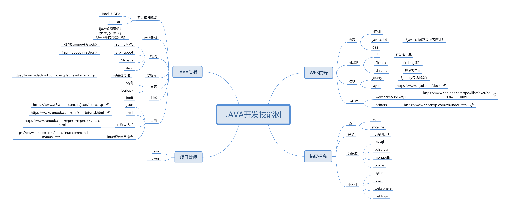
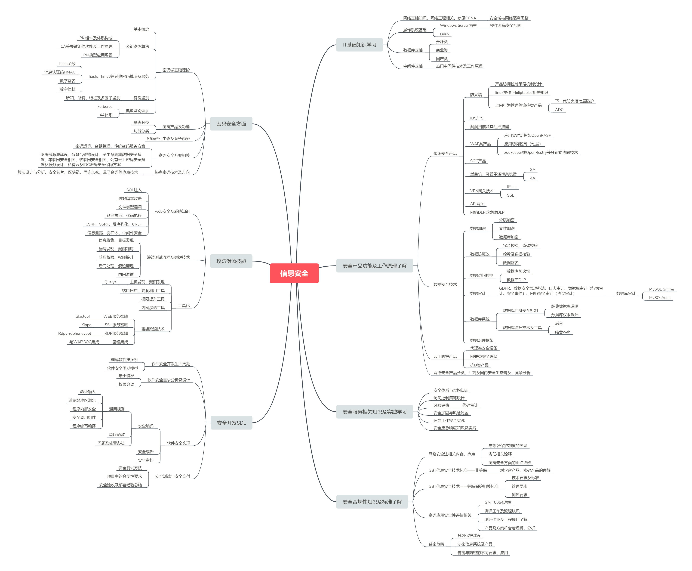
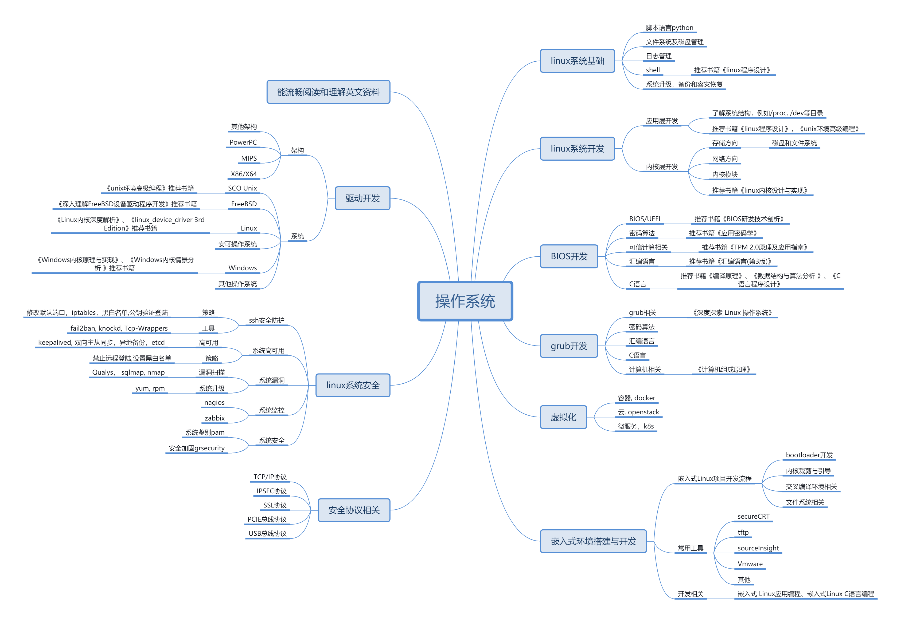
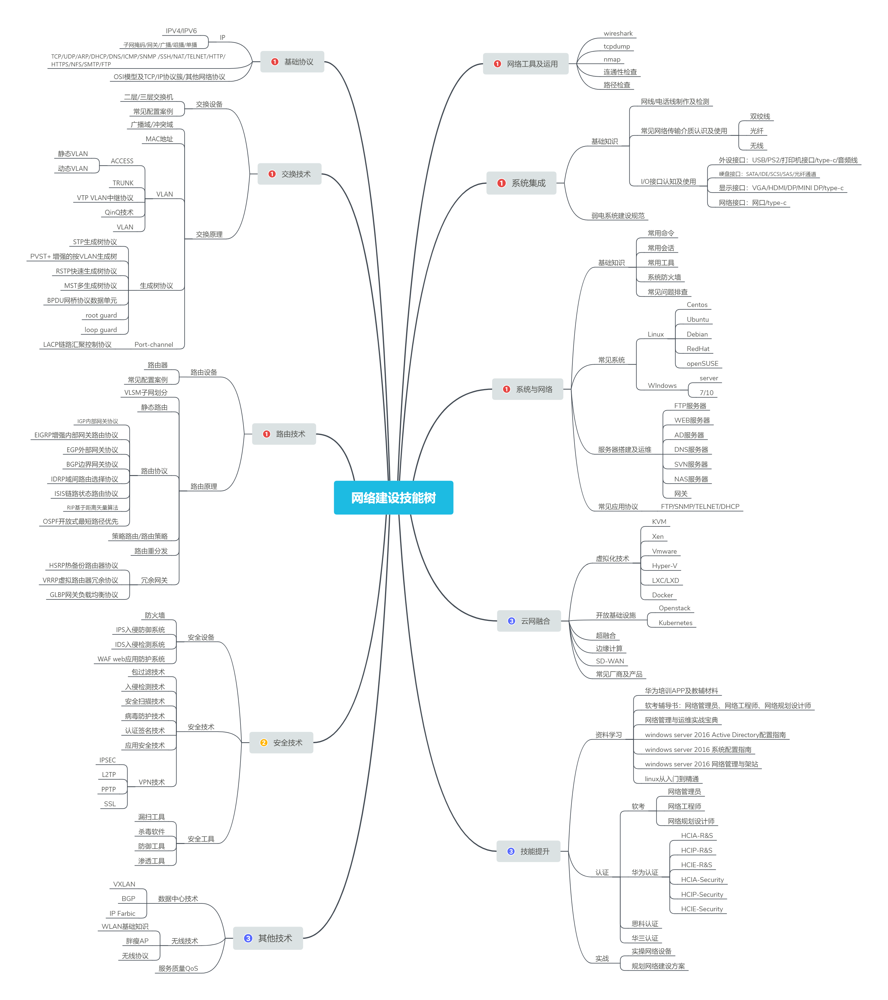
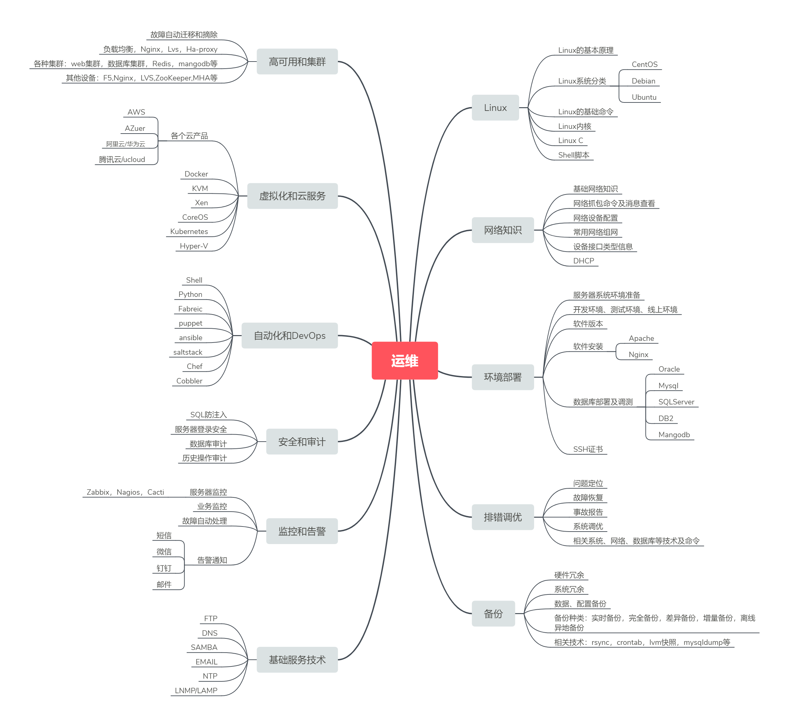

# 学无止境

IT技术是一个不断发展和变化的领域，学无止境。随着技术和市场的不断变化，我们需要始终保持敏锐的观察力和学习能力。

不断学习和提升自己的技能是非常重要的，可以帮助我们更好地适应快速变化的市场和技术环境。因此，我相信在这个快速发展的行业中，持续不断地学习和进步是必不可少的。

JAVA开发技能树

信息安全技能树

密码算法技能树

操作系统技能树

数据库技能技能树

硬件开发技能树

系统架构技能树

网络建设技能树

运维技能树
