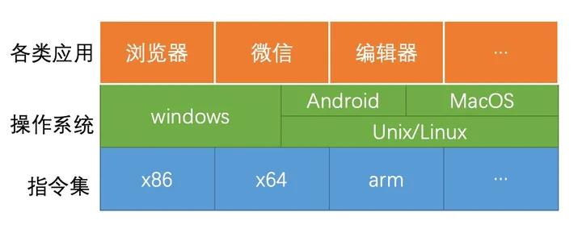

### 概述

写代码用到的一套规范及其延伸工具。

### 相关概念

### 参考

- [到底学哪一门编程语言](https://windliang.wang/2019/11/06/%E5%88%B0%E5%BA%95%E5%AD%A6%E5%93%AA%E4%B8%80%E9%97%A8%E7%BC%96%E7%A8%8B%E8%AF%AD%E8%A8%80/)
- [x86-x64-x86-64-amd64-arm 指令集架构之间的关系](https://windliang.wang/2020/03/11/x86-x64-x86-64-amd64-arm%E6%8C%87%E4%BB%A4%E9%9B%86%E6%9E%B6%E6%9E%84%E4%B9%8B%E9%97%B4%E7%9A%84%E5%85%B3%E7%B3%BB/)
- [linux 和 Android 的关系](https://windliang.wang/2019/05/21/linux%E5%92%8CAndroid%E7%9A%84%E5%85%B3%E7%B3%BB/)
