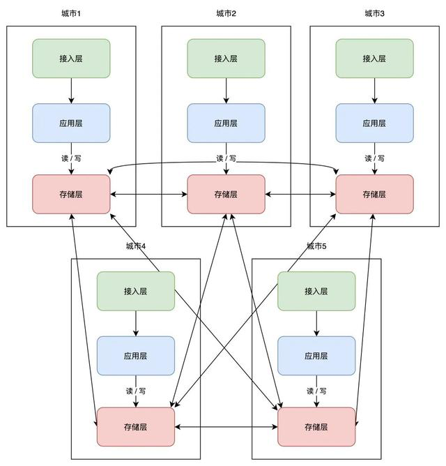

[干货｜搞懂「异地多活」，看这篇就够了](https://baijiahao.baidu.com/s?id=1714292603624190772&wfr=spider&for=pc)

### 单机架构
#### 【没有数据备份】
#### 【有数据备份、非实时】
#### 【有数据备份、实时、主从数据库、非读写分离】
#### 【有数据备份、实时、主从数据库、读写分离】
### 分布式架构【同城一个机房】
#### 【没有数据备份】
#### 【有数据备份、非实时】
#### 【有数据备份、实时、主从数据库、非读写分离】
#### 【有数据备份、实时、主从数据库、读写分离】
### 分布式架构【同城2个机房】
#### 【冷备】
#### 【热备】
#### 【同城双活】
### 分布式架构【两城3个机房】

在【同城双活】的基础上新增了一个异地（非一个城市）机房。

#### 【两地三中心、灾备】

### 分布式架构【伪异地双活】

### 分布式架构【异地双活】

路由层的规则怎么定，一般是根据业务类型、哈希算法(例如用户ID)、地理位置等

### 分布式架构【异地多活】

【网状】

【星状】

