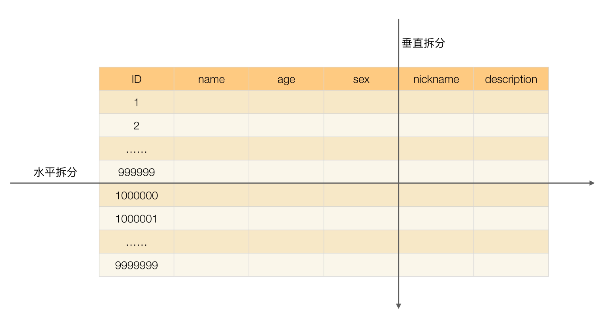

虽然近十年来各种存储技术飞速发展，但关系数据库由于其 ACID 的特性和功能强大的 SQL 查询，目前还是各种业务系统中关键和核心的存储系统，很多场景下高性能的设计最核心的部分就是关系数据库的设计。

不管是为了满足业务发展的需要，还是为了提升自己的竞争力，关系数据库厂商（Oracle、DB2、MySQL 等）在优化和提升单个数据库服务器的性能方面也做了非常多的技术优化和改进。但业务发展速度和数据增长速度，远远超出数据库厂商的优化速度，尤其是互联网业务兴起之后，海量用户加上海量数据的特点，单个数据库服务器已经难以满足业务需要，必须考虑数据库集群的方式来提升性能。

高性能数据库集群的第一种方式是“读写分离”，其本质是将访问压力分散到集群中的多个节点，但是没有分散存储压力；第二种方式是“分库分表”，既可以分散访问压力，又可以分散存储压力。

### 读写分离原理

读写分离的基本原理是将数据库读写操作分散到不同的节点上，下面是其基本架构图。

读写分离的实现逻辑并不复杂，但有两个细节点将引入设计复杂度：主从复制延迟和分配机制。

解决主从复制延迟有几种常见的方法：

1. 写操作后的读操作指定发给数据库主服务器
2. 读从机失败后再读一次主机
3. 关键业务读写操作全部指向主机，非关键业务采用读写分离

将读写操作区分开来，然后访问不同的数据库服务器，一般有两种方式：程序代码封装和中间件封装。

程序代码封装的方式，在目前开源的实现方案中，淘宝的 TDDL（Taobao Distributed Data Layer，外号: 头都大了）是比较有名的。它是一个通用数据访问层，所有功能封装在 jar 包中提供给业务代码调用。

中间件封装指的是独立一套系统出来，实现读写操作分离和数据库服务器连接的管理。中间件对业务服务器提供 SQL 兼容的协议，业务服务器无须自己进行读写分离。对于业务服务器来说，访问中间件和访问数据库没有区别，事实上在业务服务器看来，中间件就是一个数据库服务器。

目前的开源数据库中间件方案中，MySQL 官方先是提供了 MySQL Proxy，但 MySQL Proxy 一直没有正式 GA，现在 MySQL 官方推荐 MySQL Router。奇虎 360 公司也开源了自己的数据库中间件 Atlas，Atlas 是基于 MySQL Proxy 实现的。

### 分库分表

业务分库指的是按照业务模块将数据分散到不同的数据库服务器。虽然业务分库能够分散存储和访问压力，但同时也带来了新的问题，接下来我进行详细分析。

1. join 操作问题，业务分库后，原本在同一个数据库中的表分散到不同数据库中，导致无法使用 SQL 的 join 查询。
2. 事务问题，原本在同一个数据库中不同的表可以在同一个事务中修改，业务分库后，表分散到不同的数据库中，无法通过事务统一修改。虽然数据库厂商提供了一些分布式事务的解决方案（例如，MySQL 的 XA），但性能实在太低，与高性能存储的目标是相违背的。
3. 成本问题

将不同业务数据分散存储到不同的数据库服务器，能够支撑百万甚至千万用户规模的业务，但如果业务继续发展，同一业务的单表数据也会达到单台数据库服务器的处理瓶颈。例如，淘宝的几亿用户数据，如果全部存放在一台数据库服务器的一张表中，肯定是无法满足性能要求的，此时就需要对单表数据进行拆分。

单表数据拆分有两种方式：垂直分表和水平分表。示意图如下：

