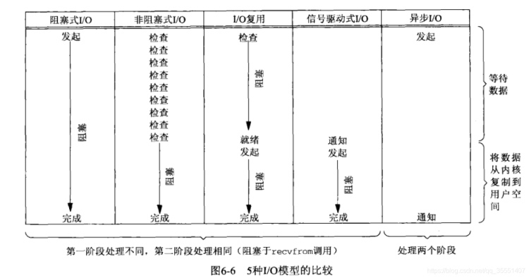

### 5种I/O模型比较

### 简介

Reactor(反应堆模式)是libevent的中心思想，常规的I/O多路复用中采用select和poll、epoll等来实现。而Reactor是将上述机制进一步封装，通俗的来讲，就是通过回调机制实现。我们只需将事件的接口注册到Reactor上，当事件发生之后，会回调注册的接口。

Reactor是一种事件驱动机制。和普通函数调用的不同之处在于：应用程序不是主动的调用某个API完成处理，而是恰恰相反，Reactor逆置了事件处理流程，应用程序需要提供相应的接口并注册到Reactor上，如果相应的事件发生，Reactor将主动调用应用程序注册的接口，这些接口又称为“回调函数”。

Reactor 模式也叫 Dispatcher 模式（在很多开源的系统里面会看到这个名称的类，其实就是实现 Reactor 模式的），更加贴近模式本身的含义，即 I/O 多路复用统一监听事件，收到事件后分配（Dispatch）给某个进程。

Reactor 模式的核心组成部分包括 Reactor 和处理资源池（进程池或线程池），其中 Reactor 负责监听和分配事件，处理资源池负责处理事件。初看 Reactor 的实现是比较简单的，但实际上结合不同的业务场景，Reactor 模式的具体实现方案灵活多变，主要体现在：Reactor 的数量可以变化：可以是一个 Reactor，也可以是多个 Reactor。资源池的数量可以变化：以进程为例，可以是单个进程，也可以是多个进程（线程类似）。将上面两个因素排列组合一下，理论上可以有 4 种选择，但由于“多 Reactor 单进程”实现方案相比“单 Reactor 单进程”方案，既复杂又没有性能优势，因此“多 Reactor 单进程”方案仅仅是一个理论上的方案，实际没有应用。最终 Reactor 模式有这三种典型的实现方案：单 Reactor 单进程 / 线程。单 Reactor 多线程。多 Reactor 多进程 / 线程。以上方案具体选择进程还是线程，更多地是和编程语言及平台相关。例如，Java 语言一般使用线程（例如，Netty），C 语言使用进程和线程都可以。例如，Nginx 使用进程，Memcache 使用线程。

单 Reactor 单进程的方案在实践中应用场景不多，只适用于业务处理非常快速的场景，目前比较著名的开源软件中使用单 Reactor 单进程的是 Redis。需要注意的是，C 语言编写系统的一般使用单 Reactor 单进程，因为没有必要在进程中再创建线程；而 Java 语言编写的一般使用单 Reactor 单线程，因为 Java 虚拟机是一个进程，虚拟机中有很多线程，业务线程只是其中的一个线程而已。

目前著名的开源系统 Nginx 采用的是多 Reactor 多进程，采用多 Reactor 多线程的实现有 Memcache 和 Netty。

### Reactor模式结构

在Reactor模式中，有以下几个关键的参与者。

1. 描述符（handle）由操作系统提供，用于识别每一个事件，如Socket描述符、文件描述符等。在Linux中，它用一个整数来表示。事件可以来自外部，如来自客户端的连接请求、数据等。事件也可以来自内部，如定时器事件。
2. 同步事件分离器（demultiplexer）是一个函数，用来等待一个或多个事件的发生。调用者会被阻塞，直到分离器分离的描述符集上有事件发生。Linux的select函数是一个经常被使用的分离器。
3. 事件处理器接口（event handler）是由一个或多个模板函数组成的接口。这些模板函数描述了和应用程序相关的对某个事件的操作。 具体的事件处理器：是事件处理器接口的实现。它实现了应用程序提供的某个服务。每个具体的事件处理器总和一个描述符相关。它使用描述符来识别事件、识别应用程序提供的服务。
4. Reactor 管理器（reactor）：定义了一些接口，用于应用程序控制事件调度，以及应用程序注册、删除事件处理器和相关的描述符。它是事件处理器的调度核心。 Reactor管理器使用同步事件分离器来等待事件的发生。一旦事件发生，Reactor管理器先是分离每个事件，然后调度事件处理器，最后调用相关的模 板函数来处理这个事件。
5. 通过上述分析，我们注意到，是Reactor管理器而不是应用程序负责等待事件、分离事件和调度事件。实际上，Reactor管理器并没有被具体的 事件处理器调用，而是管理器调度具体的事件处理器，由事件处理器对发生的事件做出处理。这就是类似Hollywood原则的“反向控制”。应用程序要做的 仅仅是实现一个具体的事件处理器，然后把它注册到Reactor管理器中。接下来的工作由管理器来完成。这些参与者的相互关系如下图所示。

### Reactor 处理步骤

1. 初始化一个Reactor管理器
2. 初始化事件处理器,设置事件源及回调函数
3. 将事件处理器注册到Reactor管理器上
4. 注册该事件
5. 进入循环等待事件发生并处理

### 优点

1. 响应快，不必为单个同步时间所阻塞，虽然Reactor本身依然是同步的；
2. 编程相对简单，可以最大程度的避免复杂的多线程及同步问题，并且避免了多线程/进程的切换开销；
3. 可扩展性，可以方便的通过增加Reactor实例个数来充分利用CPU资源；
4. 可复用性，reactor框架本身与具体事件处理逻辑无关，具有很高的复用性；

