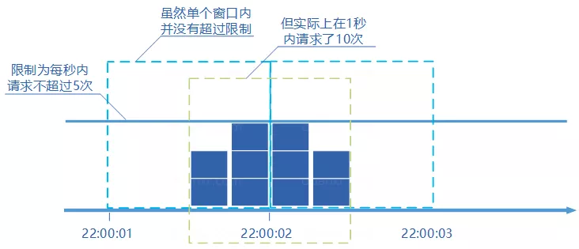
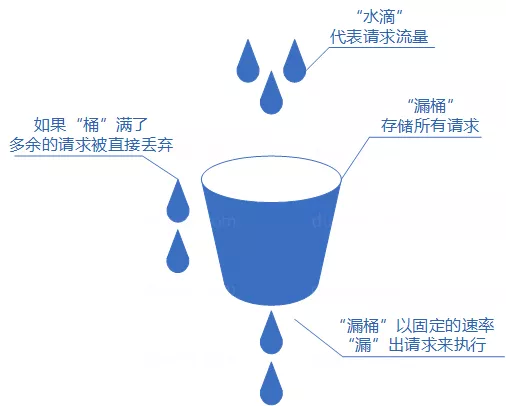
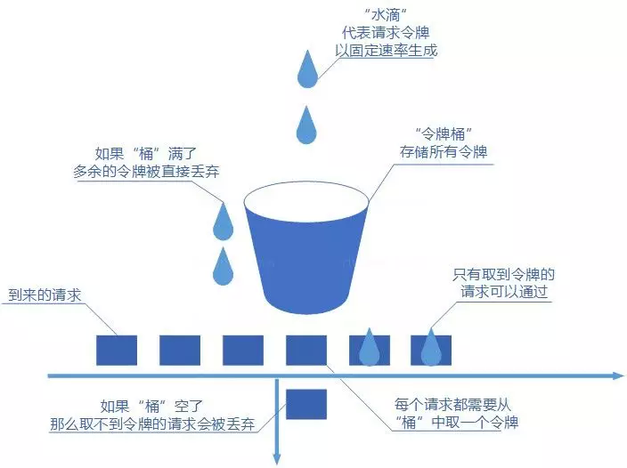

### 前言

在开发高并发系统时有三把利器用来保护系统：缓存、降级和限流

- `缓存`缓存的目的是提升系统访问速度和增大系统处理容量
- `降级`降级是当服务出现问题或者影响到核心流程时，需要暂时屏蔽掉，待高峰或者问题解决后再打开
- `限流`限流的目的是通过对并发访问/请求进行限速，或者对一个时间窗口内的请求进行限速来保护系统，一旦达到限制速率则可以拒绝服务、排队或等待、降级等处理

### 常见的限流算法

#### 固定窗口计数器

- 固定窗口计数器算法的概念如下
   1. 将时间划分为多个窗口
   2. 在每个窗口内每有一次请求就将计数器加一
   3. 如果计数器超过了限制数量，则本窗口内新来的其他请求都被丢弃。当时间到达下一个窗口时，计数器重置。
- 固定窗口计数器是最为简单的算法，但这个算法有时会让通过请求量允许为限制的两倍。考虑如下情况：限制 1 秒内最多通过 5 个请求，在第一个窗口的最后半秒内通过了 5 个请求，第二个窗口的前半秒内又通过了 5 个请求。这样看来就是在 1 秒内通过了 10 个请求。

#### 滑动窗口计数器

- 滑动窗口计数器算法概念如下：
   1. 将时间划分为多个区间；
   2. 在每个区间内每有一次请求就将计数器加一维持一个时间窗口，占据多个区间；
   3. 每经过一个区间的时间，则抛弃最老的一个区间，并纳入最新的一个区间；
   4. 如果当前窗口内区间的请求计数总和超过了限制数量，则本窗口内新来的其他请求都被丢弃。
- 滑动窗口计数器是通过将窗口再细分，并且按照时间 " 滑动 "，这种算法避免了固定窗口计数器带来的双倍突发请求，但时间区间的精度越高，算法所需的空间容量就越大。

#### 漏桶算法

- 漏桶算法概念如下：
   1. 将每个请求视作 " 水滴 " 放入 " 漏桶 " 进行存储；
   2. “漏桶 " 以固定速率向外 " 漏 " 出请求来执行如果 " 漏桶 " 空了则停止 " 漏水”；
   3. 如果 " 漏桶 " 满了则多余的 " 水滴 " 会被直接丢弃。
- 漏桶算法多使用队列实现，服务的请求会存到队列中，服务的提供方则按照固定的速率从队列中取出请求并执行，过多的请求则放在队列中排队或直接拒绝。
- 漏桶算法的缺陷也很明显，当短时间内有大量的突发请求时，即便此时服务器没有任何负载，每个请求也都得在队列中等待一段时间才能被响应。

#### 令牌桶算法

- 令牌桶算法概念如下：
   1. 令牌以固定速率生成。
   2. 生成的令牌放入令牌桶中存放，如果令牌桶满了则多余的令牌会直接丢弃，当请求到达时，会尝试从令牌桶中取令牌，取到了令牌的请求可以执行。
   3. 如果桶空了，那么尝试取令牌的请求会被直接丢弃。
- 令牌桶算法既能够将所有的请求平均分布到时间区间内，又能接受服务器能够承受范围内的突发请求，因此是目前使用较为广泛的一种限流算法。

### 单体应用实现

- 在传统的单体应用中限流只需要考虑到多线程即可，使用Google开源工具类guava即可。其中有一个RateLimiter专门实现了单体应用的限流，使用的是令牌桶算法。
- 单体应用的限流不是本文的重点，官网上现成的API，读者自己去看看即可，这里不再详细解释。

### 分布式限流

- 分布式限流和熔断现在有很多的现成的工具，比如Hystrix，Sentinel 等，但是还是有些企业不引用外来类库，因此就需要自己实现。
- Redis作为单线程多路复用的特性，很显然能够胜任这项任务。
